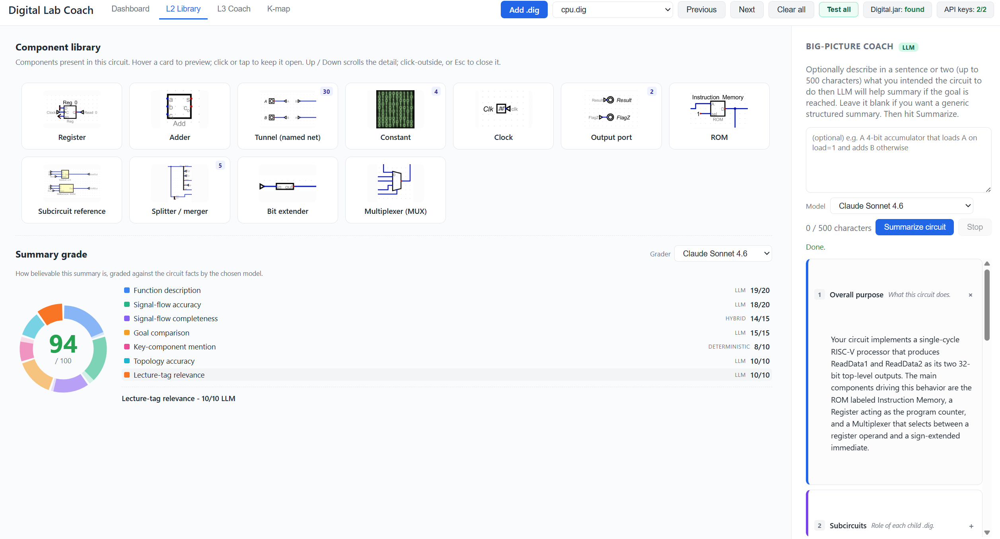
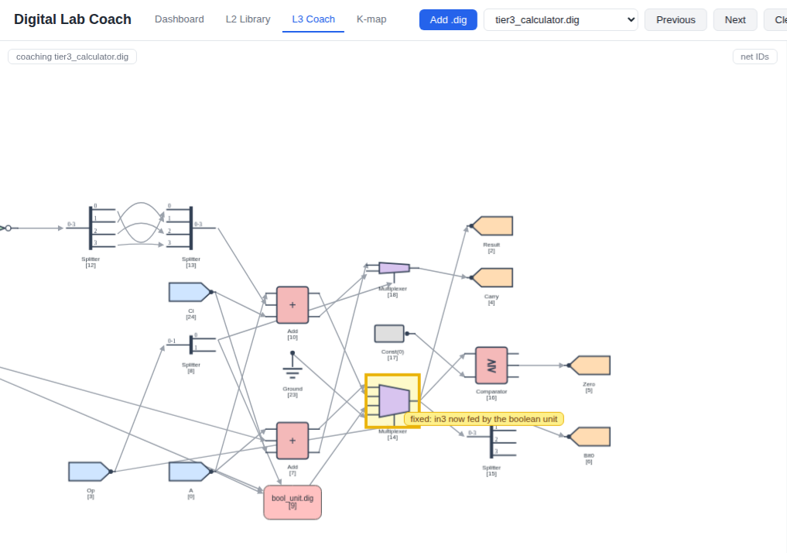
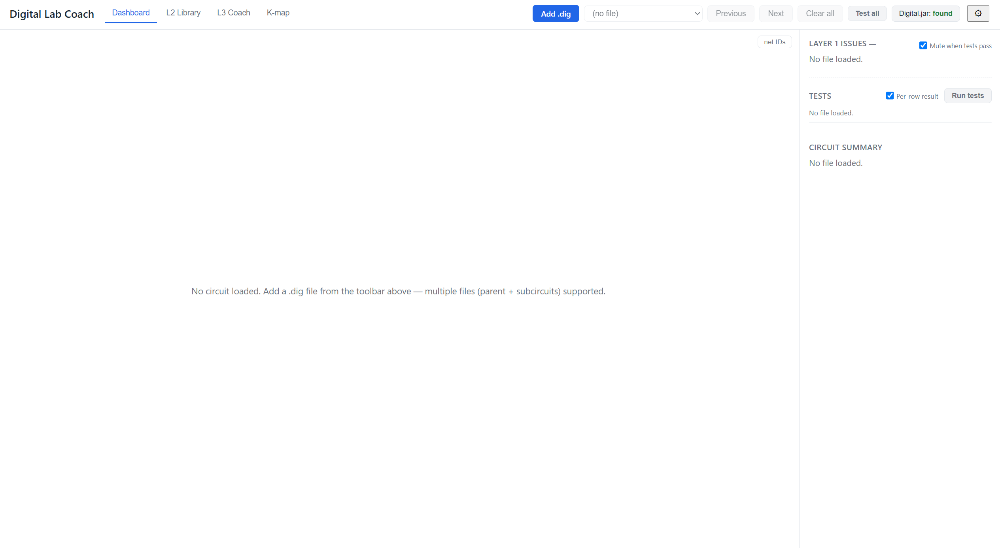
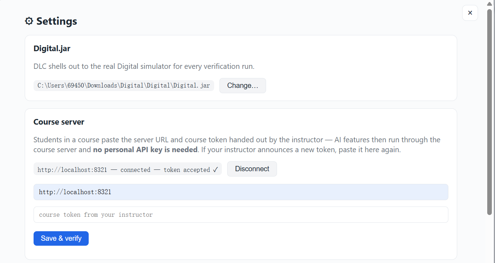
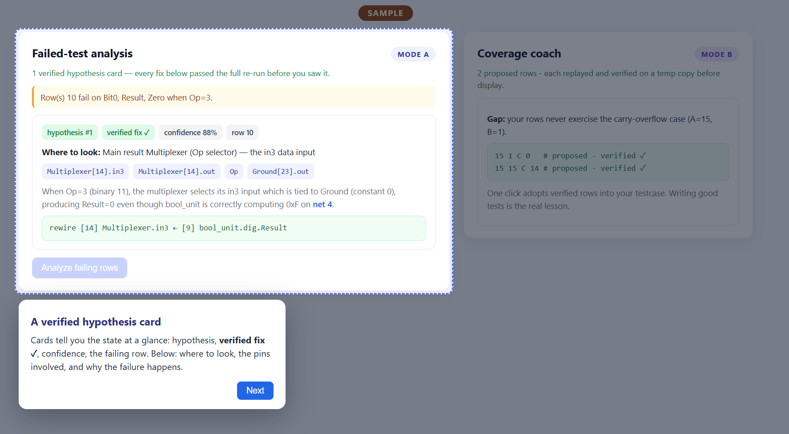
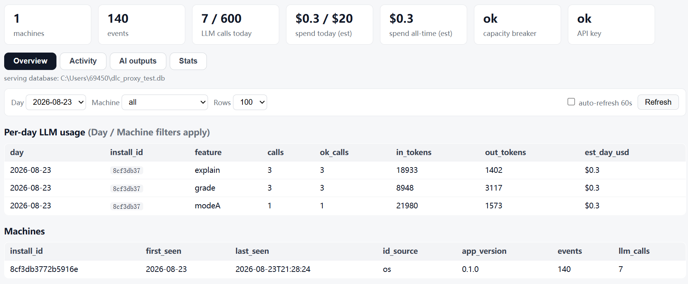

# Digital Lab Coach (DLC)

A hybrid deterministic-checker + LLM feedback tool for debugging
[Digital](https://github.com/hneemann/Digital) circuit labs.
Three layers: structural analysis (Layer 1), conceptual explanation
(Layer 2), and a machine-verified debugging + test-coverage coach
(Layer 3) — every LLM fix proposal is re-run against the official tests
before a student sees it.




## Status

v0.1.0 (2026/8/23) — first packaged release.

## Table of contents

- [Which start flow are you?](#which-start-flow-are-you)
- [Quick start (students)](#quick-start-students)
  - [Working offline](#working-offline)
  - [Telemetry notice](#telemetry-notice)
  - [Uninstalling](#uninstalling)
- [Instructor setup](#instructor-setup)
  - [Course tokens](#course-tokens)
  - [Running the course proxy](#running-the-course-proxy)
  - [The course dashboard](#the-course-dashboard)
  - [Rotating the course token](#rotating-the-course-token)
- [File layout](#file-layout)
- [Developer setup](#developer-setup)
- [Troubleshooting (Windows): Smart App Control](#troubleshooting-windows-uv-run-blocked-by-smart-app-control)
- [Digital.jar for per-row test verification](#user-and-developer-optional-setup-digitaljar-for-per-row-test-verification)
- [License](#license)
- [Upstream](#upstream)

## Which start flow are you?

- **Student in a course using DLC** → *Quick start (students)* below.
  Your instructor gives you a course-server URL + token — you do NOT
  need any API key.
- **Instructor releasing DLC for a course** → *Instructor setup* below,
  with the full runbook in
  [docs/RELEASE_GUIDE.md](docs/RELEASE_GUIDE.md).
- **Developer / contributor** → *Developer setup* below.

## Quick start (students)

1. Download the release zip from your course page (or this repo's
   **Releases**) and unzip it anywhere.
2. Double-click **`START_HERE.bat`** (Windows) or run **`./start.sh`**
   (macOS/Linux). The first run installs its own toolchain and takes a
   few minutes; your browser then opens the app at
   `http://127.0.0.1:8765`.


*(screenshot to add: the START_HERE terminal on first run, right as the
browser tab opens)*

3. First run asks for your `Digital.jar` location — the same jar you run
   labs with (see the Digital.jar section below if you don't have one).
4. Open **Settings (gear icon) → Course server** and paste the **URL +
   course token** from your instructor. That powers all AI features — no
   personal API key needed. If your instructor announces a new token
   later, paste it in the same place.


*(screenshot to add: the Settings → Course server card with URL + token
fields filled, state showing "connected ✓")*

5. Upload your `.dig` files and work: interactive graph, structural
   issues, per-row tests, signal flow — and the Layer 2/3 AI coach.


*(screenshot to add: a Failed-test analysis card with "verified fix ✓" —
the LED4 or Wrong_cin one is perfect)*

### Working offline

Everything deterministic — the graph, structural issues, per-row tests,
signal flow, subcircuit drill-in — works with no internet at all. Only
the AI coach needs the course-server connection.

### Telemetry notice

DLC records anonymized usage events (feature clicks, test runs, coach
outcomes) keyed to a hashed machine id — never your name, or your files'
contents beyond what the coach needs. Events sync to the course server
for course-improvement research; deleting and re-downloading the tool
continues the same anonymous record. Questions or opt-out: contact your
instructor.

### Uninstalling

Run **`UNINSTALL.bat`** / **`./uninstall.sh`** (removes the tool's local
data folder `~/.dlc`), then delete the unzipped folder. Course usage
limits live on the course server and are keyed to your machine —
uninstalling or re-downloading never resets them.

## Instructor setup

The short version (each step's details:
[docs/RELEASE_GUIDE.md](docs/RELEASE_GUIDE.md)):

1. Fork this repository; configure the official test set (and manifest,
   if your labs go beyond the built-ins) — step-by-step:
   [docs/MANIFEST_GUIDE.md](docs/MANIFEST_GUIDE.md).
2. Labs whose instruction ROM should carry a course program at grading
   time: [docs/instructor_rom_config.md](docs/instructor_rom_config.md).
3. Generate the two course secrets, deploy the course proxy (holds YOUR
   API key), and hand students your release URL + the proxy URL + course
   token — all below.

### Course tokens

```bash
python -c "import secrets; print('course-' + secrets.token_urlsafe(18))"
python -c "import secrets; print('admin-'  + secrets.token_urlsafe(18))"
```

Each command prints one token in the terminal. The **course token** goes
to students; the **admin token** stays with you (it opens the
dashboard). Store both in a private note outside any git folder; they
are never committed and never baked into a release.

### Running the course proxy

The proxy ([proxy/README.md](proxy/README.md)) holds your API key,
enforces per-machine daily limits that survive re-downloads, collects
the anonymized telemetry, and serves the dashboard:

```bash
export ANTHROPIC_API_KEY=sk-ant-...
export DLC_COURSE_TOKEN=<course token>
export DLC_ADMIN_TOKEN=<admin token>
export DLC_PROXY_DB=/path/to/dlc_proxy.db
uv run uvicorn proxy.dlc_proxy:app --host 0.0.0.0 --port 8321
```

Three spend-protection layers are on by default: per-student daily caps
(Mode A 1/day, Mode B 2/day), per-machine wipe-proof backstops, and a
whole-server daily circuit breaker (`DLC_GLOBAL_DAILY_CALLS`, default
600 calls; `DLC_GLOBAL_DAILY_USD`, default $20) — a leaked token can
burn at most one day's cap. Deployment options (own machine vs $5/month
VPS with HTTPS) are in the release guide.

### The course dashboard

Open `http://<proxy-host>:8321/admin/view`, enter the admin token once
(kept only in your browser): machines, per-day activity, per-day LLM
usage and estimated spend, breaker state. Raw exports:
`/admin/export.csv?table=events|machines|llm_calls`.


*(screenshot to add: /admin/view after your class test — tiles + the
machines table)*

### Rotating the course token

Generate a new course token, restart the proxy with it, announce it;
students paste the new token under Settings → Course server. No
re-release, no re-download; identities, history and limits are
untouched.

## File layout

| Path | Role |
|---|---|
| `dlc/parser/` | Reads `.dig` XML into structured Python objects: components, wires, nets, signal-flow graph.
| `dlc/facts/` | Extracts a JSON-serializable bundle of facts the LLM and deterministic checkers consume: inventory, per-net widths, per-component topology, structural bug list.
| `dlc/testing/` | Reads each Testcase's embedded test rows out of the `.dig`, parses Digital's CLI output, and pinpoints which specific rows fail — one fast `CLI test -verbose` call per file (with expected-vs-found cells per failing row), falling back to cumulative one-row-at-a-time runs when the fast mapping can't be trusted.
| `dlc/analyzer/` | Deterministic checkers — wire completeness, bit widths, combinational loops, interface conformance, sequential timing. Shallow (top circuit) and deep (whole subcircuit tree) variants.
| `dlc/sim/` | Deterministic value evaluator — combinational + sequential simulator (`simulator.py`) that computes the value on every net for a given test row, with hierarchical (path-keyed) register state for clocked designs and recursive subcircuit evaluation. Powers the signal-flow-on-row-click UI and the subcircuit drill-in.
| `dlc/web/` | FastAPI server (`server.py`) + browser front-end (`static/app.js`) for the Layer 1/2 web app: interactive graph, structural-issue overlay, per-row test runner, signal-flow-on-row-click, subcircuit drill-in, and the Layer 2 coach.
| `dlc/llm/` | LLM client wrapper and versioned prompts for conceptual explanation + credibility grading (Layer 2) and strategic debugging (Layer 3).
| `dlc/telemetry/` | Anonymous machine identity, per-interaction logging to a local SQLite spool, and the shipper that syncs it to the course proxy.
| `proxy/` | The course proxy server an instructor deploys: API-key custody, per-machine daily limits (re-download-proof), global daily circuit breaker, telemetry ingest, admin dashboard/summary/export.
| `dlc/cli/` | Command-line entrypoint that wires the layers together for student use.
| `prompts/` | Versioned LLM prompt templates — one file per prompt variant, consumed by `dlc/llm/`.
| `configs/` | Per-lab YAML configs (expected I/Os, handout context etc.).
| `data/sample_circuits/` | Test fixtures — public sample circuits created by authors.
| `docs/` | Guides for instructors, release runbook, RISC-V labs manifest guides, screenshots, architecture notes, design decisions, dev log, dev debug guide.
| `tests/` | pytest unit tests, one file per source module.
| `START_HERE.bat` / `start.sh` | One-click student launchers (install toolchain if needed, start the app with limits on, open the browser).
| `UNINSTALL.bat` / `uninstall.sh` | Removes the local `~/.dlc` data folder.

## Developer setup

(For best experience, run the setup and testing flow using bash.)

Need Python version >=3.12; 3.12 is best for developing.

**Linux only — install tkinter at the OS level:**
`uv`-managed Python and many distro Pythons don't bundle tkinter.
DLC needs it for the first-run Digital.jar file-picker dialog and
for 3 file-picker tests in the suite. macOS and Windows ship tkinter
with python.org Python — skip this step there.

```bash
# Debian / Ubuntu
sudo apt install python3-tk
# Fedora / RHEL
sudo dnf install python3-tkinter
# Arch
sudo pacman -S tk
```

**General:**
```bash
# Install uv once (skip if already installed)
# macOS / Linux:
curl -LsSf https://astral.sh/uv/install.sh | sh
# Windows PowerShell:
powershell -ExecutionPolicy ByPass -c "irm https://astral.sh/uv/install.ps1 | iex"

# Clone and run tests
git clone <repo-url>
cd digital-lab-coach
uv run pytest
```
After all tests are green you are all set — run the web app with:

```bash
uv sync
uv run python -m dlc.web.server
```

(`START_HERE` does the same, plus `DLC_ENFORCE_LIMITS=1` — the released
student caps. Developers usually run without it so limits never block a
debugging session.)

**Side notes**

>   The shell installer only updates the shell it's run from. If you
>   install `uv` via Git Bash but want to use it from PowerShell, run
>   the PowerShell installer too.

>   After install, **close and reopen** your terminal (restart VS Code
>   if it still can't find `uv`.)

>   In Git Bash, prefer forward slashes (`C:/Users/...`)

>   PowerShell doesn't always parse multi-line `python -c "..."` blocks
>   cleanly. For the `test_notes.md` manual tests, use Git Bash, or save
>   the script to a `.py` file and run `uv run python script.py`.

## Troubleshooting (Windows): `uv run` blocked by Smart App Control

**Symptom** — `uv run python ...` fails *before* the app starts:

```
error: Failed to spawn: `python`
  Caused by: ... (os error 4551)
# or, after forcing a system Python:
Querying Python at `...\WindowsApps\python3.exe` failed (exit code 0x800711c7)
```

`os error 4551`:
an *application control policy has blocked this file*. Windows 11's **Smart App
Control** can switch itself from *Evaluation* to *On* (e.g. after an update),
and then it blocks unsigned executables — including the Python `uv` downloads
(python-build-standalone) and the Microsoft Store `python3.exe` alias stub. A
`.venv` built on a now-blocked interpreter stops launching too. This is an
environment/OS block.

**Fix — install a *signed* Python and rebuild the venv:**

1. **Disable the Store alias stubs** so they stop shadowing the real Python:
   Settings → Apps → Advanced app settings → App execution aliases → turn
   **off** `python.exe`, `python3.exe` and `pythonw.exe`.
2. **Install a signed Python 3.12** from <https://www.python.org> (PSF-signed;
   tick *"Add python.exe to PATH"*). Verify it isn't blocked: `python --version`.
   If Smart App Control still blocks it, install **Python 3.12 from the
   Microsoft Store** instead — Store apps are always trusted by Smart App Control.
3. **Delete the dead venv and rebuild** against the signed Python (Git Bash):

```bash
rm -rf .venv
uv venv --python "C:/Users/<you>/AppData/Local/Programs/Python/Python312/python.exe"
uv sync
uv run python -m dlc.web.server
```

> Don't turn Smart App Control *off* to fix this — it is one-way (you can't
> re-enable it without reinstalling Windows). Use a signed Python instead.


## User and Developer Optional setup: Digital.jar for per-row test verification

DLC's structural analysis works on any `.dig` file with no extra setup.

**For per-row pass/fail diagnostics and failing test analysis**, the tool
runs Digital's CLI as a subprocess, so it needs to know where your `Digital.jar` is.

### Setting it up
Download Digital from
<https://github.com/hneemann/Digital>, extract anywhere, and let the first-run dialog find your jar.

If you'd rather configure it manually:

```bash
# Option A
uv run python -c "from dlc.testing.config import set_digital_jar_path; set_digital_jar_path(r'PATH_TO_YOUR_Digital.jar')"

# Option B
# macOS / Linux
export DIGITAL_JAR=/path_to_Digital/Digital.jar
# Windows PowerShell
$env:DIGITAL_JAR = "C:\path_to_Digital\Digital.jar"
```

## License

GPL-3.0. See LICENSE.

## Upstream

Built to read .dig files produced by [Digital](https://github.com/hneemann/Digital),
an open-source educational circuit simulator (GPL-3.0).
